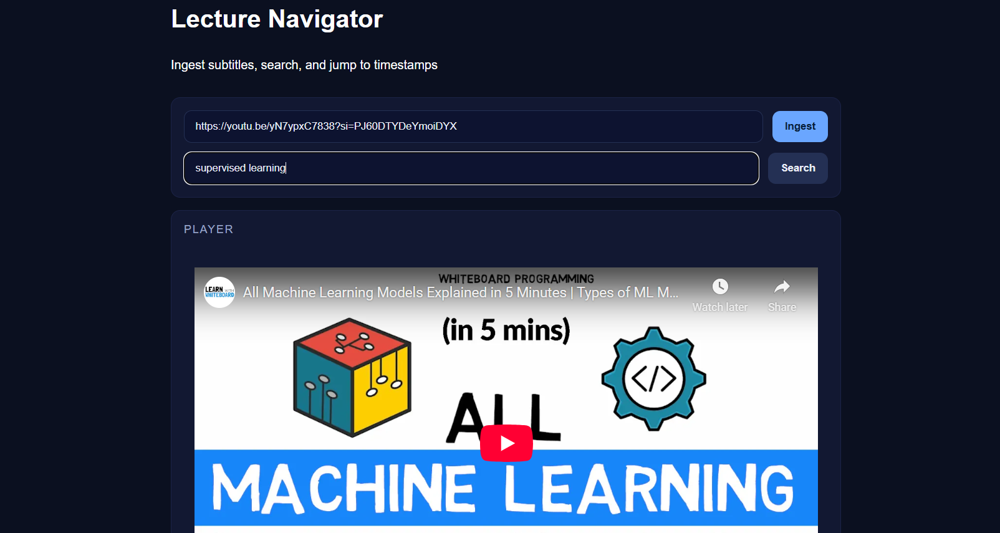
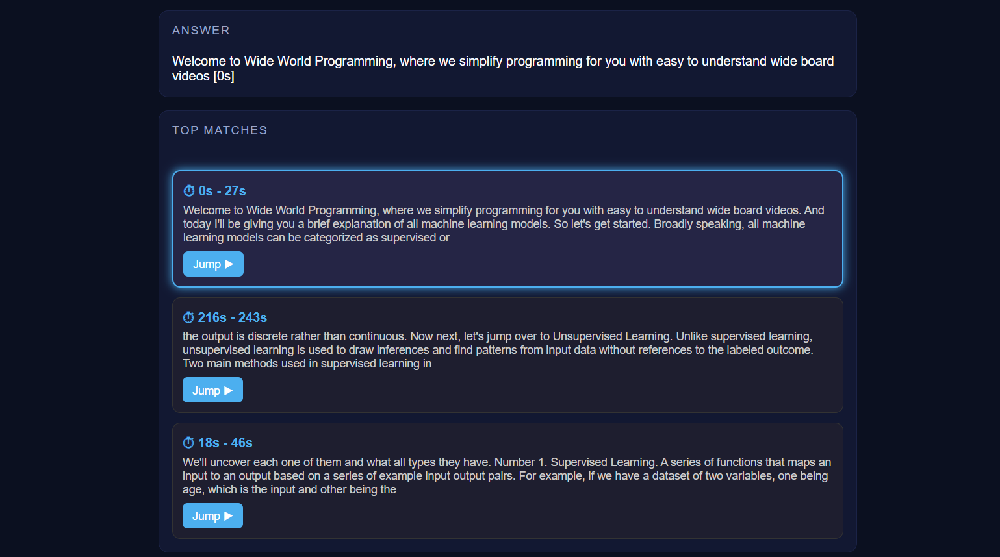

# 🎥 Lecture Navigator — Jump-to-Timestamp Agent

## 📌 Overview
Lecture Navigator helps users quickly find relevant timestamps in long lecture videos by returning **top-k timestamps** with a one-line answer and ±15s context.  
It is built as part of the 10-day project briefs with a focus on **Retrieval-Augmented Generation (RAG)** and efficient timestamp navigation.

## 🛠️ What I built
-  Transcript ingestion (YouTube/Vimeo/SubRip) → segmented (30–60s windows with overlap)  
-  Embeddings stored in Vector DB (MongoDB Atlas / Pinecone)  
-  Hybrid retrieval: **Vector search + BM25 keyword search + Cross-encoder reranker**  
-  FastAPI backend with `/ingest_video`, `/search_timestamps`  
-  React frontend (search box, results list, mini-player deep links)  
-  Metrics tracked: **MRR@10, Latency p95**

### 📂 Project Structure
- **backend/** →  FastAPI app with LangChain, vector store, embeddings  
- **frontend/** →  React + Vite app for UI, player, and search  
- **docs/** →  Architecture diagram, OpenAPI spec, Postman collection  
- **metrics/** →  CSV/Notebook for evaluation metrics  
- **README.md** →  Project overview & instructions  

```
QEAGLE NEW
├── backend
│   ├── .venv/
│   ├── app/
│   ├── atlas/
│   ├── scripts/
│   ├── tests/
│   ├── .env
│   ├── Dockerfile
│   └── requirements.txt
│
├── frontend
│   ├── node_modules/
│   ├── src/
│   ├── Dockerfile
│   ├── index.html
│   ├── package-lock.json
│   ├── package.json
│   └── vite.config.js
│
├── LectureNavigator/
├── notebooks/
├── Output/
│   ├── UI.png
│   └── UI1.png
│
├── sample_data/
│   └── queries.json
│
├── .gitignore
└── README.md


---

## ▶️ Run locally 

### 1️⃣ Backend (Python 3.10+)
```bash
cd backend
python -m venv .venv
source .venv/bin/activate   
pip install -r requirements.txt
uvicorn app:app --reload --port 8000
 

---

2. Frontend (React + Vite):
```bash
cd frontend
npm install
npm run dev
```

## API (short)
- `POST /ingest_video` — ingest video URL or file, returns `video_id`
- `POST /search_timestamps` — {query, k=3} → {results:[{t_start,t_end,snippet,score}], answer}


## 📸 Project Output Screenshots (Frontend)




